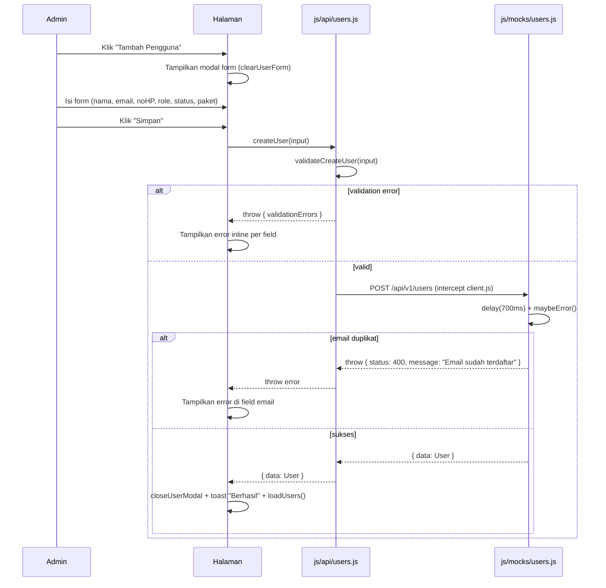

# Business Rules — Manajemen Akun

**Status**: Prototype
**Author**: Claude (imp.prototype)
**Branch**: uiux
**Last updated**: 2026-06-10

---

## Overview

Fitur Manajemen Akun pada Admin Panel Polypipe Academy memungkinkan administrator untuk melihat, menambah, mengedit, mengubah status, dan menghapus akun pengguna. Setiap akun memiliki atribut: nama, email, no HP, role (admin/pengguna), status akun, paket berlangganan, tanggal daftar, dan last login.

---

## State Machine

### Status Akun

| State      | Deskripsi                                         |
|------------|---------------------------------------------------|
| active     | Pengguna dapat login dan mengakses semua fitur    |
| nonaktif   | Akun dinonaktifkan oleh admin — tidak bisa login  |
| suspended  | Akun ditangguhkan karena pelanggaran              |

**Transisi Valid:**

| Dari       | Ke         | Siapa yang bisa          |
|------------|------------|--------------------------|
| active     | nonaktif   | Admin                    |
| active     | suspended  | Admin (bukan diri sendiri)|
| nonaktif   | active     | Admin                    |
| suspended  | active     | Admin                    |
| nonaktif   | suspended  | Admin                    |
| suspended  | nonaktif   | Admin                    |

**DILARANG:**
- Admin men-suspend akun milik dirinya sendiri
- User (role pengguna) mengubah status akun manapun

---

## Domain Validation Rules

| Rule                                | Express-able | Lokasi Validator            |
|-------------------------------------|--------------|-----------------------------|
| Nama min 2 char, max 100            | ✅           | validateCreateUser + HTML5  |
| Email format valid                  | ✅           | validateCreateUser + HTML5  |
| Email unik per user                 | ⚠️ (BE only) | mockCreateUser / BE service |
| No HP: diawali 08, 10–15 digit      | ✅           | validateCreateUser + pattern|
| Role: enum admin/pengguna           | ✅           | validateCreateUser          |
| Status: enum active/nonaktif/suspended | ✅        | validateCreateUser          |
| Paket: enum free/premium            | ✅           | validateCreateUser          |
| Premium wajib ada paketExpiredAt    | ✅           | validateCreateUser (cross-field) |
| Admin tidak boleh suspend diri sendiri | ⚠️ (runtime) | mockUpdateUserStatus / BE  |

---

## Permission Matrix

| Aksi                    | Admin | Pengguna |
|-------------------------|-------|----------|
| Lihat daftar pengguna   | ✅    | ❌       |
| Lihat detail pengguna   | ✅    | ❌       |
| Tambah pengguna baru    | ✅    | ❌       |
| Edit data pengguna      | ✅    | ❌       |
| Ubah status pengguna    | ✅    | ❌       |
| Ubah paket pengguna     | ✅    | ❌       |
| Hapus pengguna          | ✅    | ❌       |
| Akses admin panel       | ✅    | ❌       |

---

## Session Management

### Roles
| Role     | Deskripsi            | Akses Admin Panel |
|----------|----------------------|-------------------|
| admin    | Administrator sistem | ✅                |
| pengguna | Pengguna biasa       | ❌                |

### Session Lifecycle
```
anonymous → [login] → authenticated (role: admin) → [logout/timeout] → anonymous
authenticated → [idle 15 menit] → auto-logout
```

### Token Strategy
- Access token: JWT, expiry 1 jam
- Refresh token: 7 hari
- Storage prototype: `localStorage.__prototype_session`
- Storage production: httpOnly cookie (BE set) + CSRF token

### Idle Timeout
- 15 menit tidak ada aktivitas → auto logout
- Warning toast muncul 2 menit sebelum timeout

### Mock Accounts

| Role     | Email                 | Password     | User ID |
|----------|-----------------------|--------------|---------|
| admin    | admin@polypipe.id     | prototype123 | 1       |
| pengguna | user@polypipe.id      | prototype123 | 3       |

---

## User Journey & Flow

### Happy Path
1. Admin membuka halaman "Manajemen Akun" dari sidebar (klik "Pengguna")
2. Sistem memuat daftar pengguna via `GET /api/v1/users` — loading skeleton tampil
3. Admin melihat tabel berisi semua pengguna dengan stat summary (total, aktif, suspended, premium)
4. Admin menggunakan filter/search untuk menyaring data
5. Admin klik "Tambah Pengguna" → modal form muncul → isi data → klik "Simpan" → toast sukses → tabel refresh

### Mermaid Sequence Diagram — Tambah Pengguna



### Entry Point
- Sidebar navigasi "Pengguna" → `showPage('users')` → dispatch `prototype:page-change` → `loadUsers()`

### Exit Point
- Setelah tambah/edit/hapus berhasil: tetap di halaman, tabel refresh
- Klik sidebar menu lain: pindah halaman

### Alternative Flows

**A. Filter tidak ada hasil:**
- Filter aktif → `GET /api/v1/users?status=suspended&q=xyz` → `data: []`
- UI tampil empty state: "Tidak ditemukan. Coba ubah filter pencarian."

**B. Server error (5% chance):**
- Fetch gagal → catch error → toast error merah → tabel tampil pesan error + tombol retry

### Decision Point
- Jika pengguna yang ingin di-suspend adalah admin sendiri (id sama dengan session user) → tolak, tampilkan toast error

---

## Edge Cases

1. **Admin suspend diri sendiri** → BE & mock tolak dengan status 400 "Admin tidak dapat men-suspend akun sendiri"
2. **Email duplikat saat tambah/edit** → BE & mock tolak 400 "Email sudah terdaftar" → error muncul di field email
3. **Premium expired** → Paket badge tampil "Expired" (merah) — pengguna masih ada di sistem, admin bisa perpanjang via edit
4. **Hapus user dengan data terkait** (pembayaran, dll) → Fase produksi: BE harus handle cascade delete atau soft delete (business rule ini belum di-enforce di prototype — perlu koordinasi dengan BE)
5. **Server error saat operasi CRUD** → mock ~5% random error → UI tampil toast error, state data tidak berubah (idempotent view)

---

## Contract Test Cases

```javascript
// Test 1: Tambah user valid
assert(await createUser({ nama:'Test User', email:'test@test.com', noHp:'081234567890', role:'pengguna', status:'active', paket:'free' }))
// Expected: { data: { id, nama:'Test User', ... } }

// Test 2: Email duplikat
try { await createUser({ ...valid, email:'m.ramadhani@email.com' }) }
catch(e) { assert(e.status === 400 && e.path === 'email') }

// Test 3: Validasi no HP invalid
assert(validateCreateUser({ ...valid, noHp: '12345' })[0].path === 'noHp')

// Test 4: Admin suspend diri sendiri
try { await updateUserStatus('1', 'suspended') } // actorId='1'
catch(e) { assert(e.status === 400) }

// Test 5: Premium tanpa expired date
assert(validateCreateUser({ ...valid, paket:'premium', paketExpiredAt:null })[0].path === 'paketExpiredAt')
```

---

## Migrasi ke Production

1. BE implement endpoint sesuai `docs/shared/openapi.yaml`
2. BE enforce semua business rules di service layer (terutama email unik + admin suspend diri sendiri)
3. BE port test cases di atas → run terhadap endpoint asli
4. FE: ubah `<meta name="use-mock" content="false">` → switch ke real API
5. Session storage: ganti `localStorage.__prototype_session` dengan httpOnly cookie + CSRF token
6. Update status dokumen ini: `Status: Prototype` → `Status: Production (verified <date> di MR #<id>)`
7. Cleanup: hapus folder `js/mocks/`, hapus prototype banner, hapus fetch override di `client.js`
